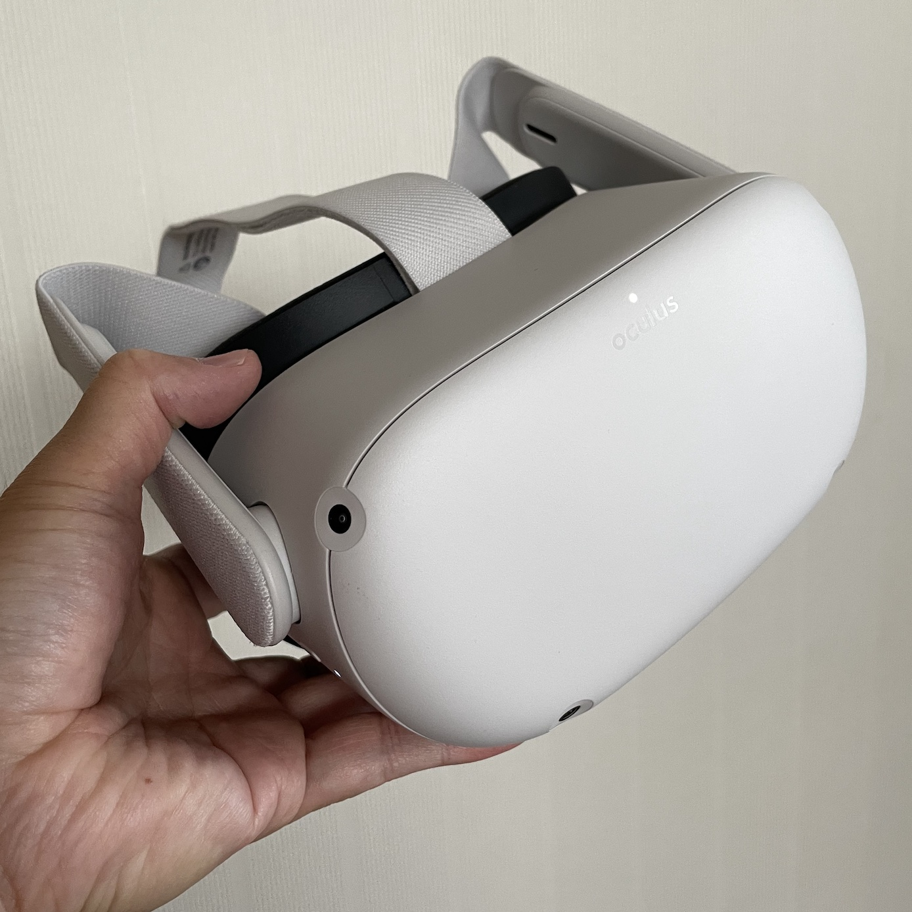
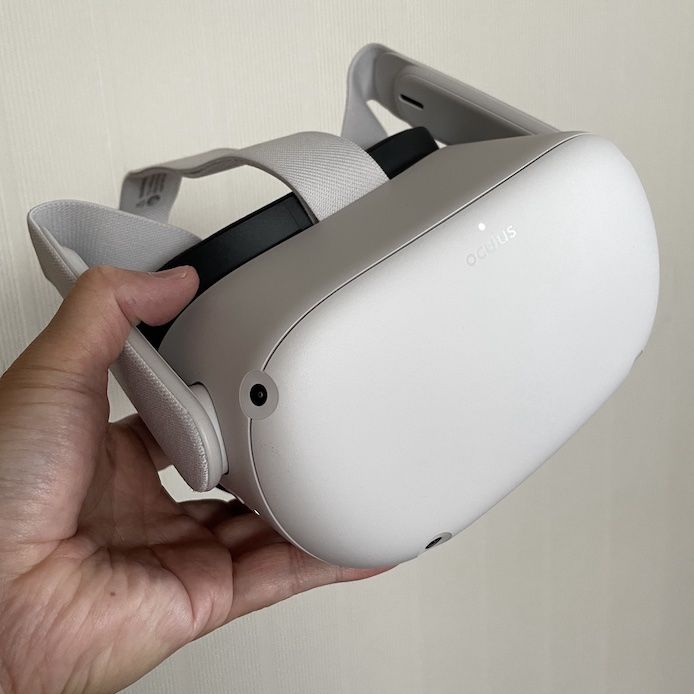
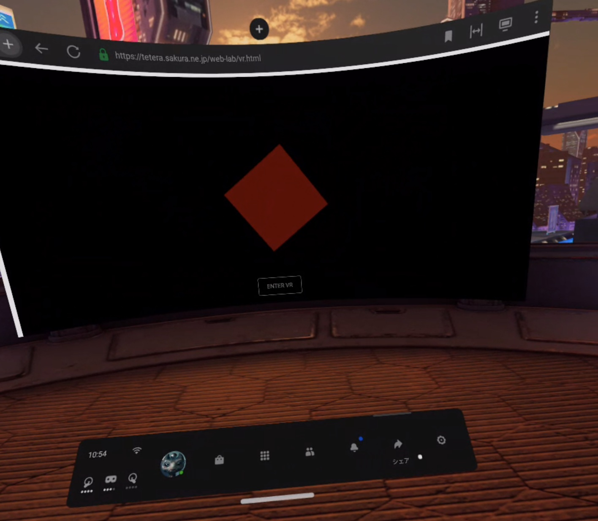

# in to VR
*昔も今も、アートマンは水に映った、おのれの影だ。<br/>それが魔族たちのウパニシャッドさ*<br/>
<br/>
*佐藤史生著：ワンゼロより*

## VR体験
　VR:virtual reality（本物と錯覚するほどの現実感）を体験することを意味する。<br/>
 錯覚の対象には、視覚、聴覚、触覚、味覚、嗅覚といったものがあるが、このリポジトリでは、主に視覚を対象とし、コンピュータで作り出した3次元イメージの中に自分が放り込まれたような体験を意味する。
 
### 3DCGI（コンピュータで作り出した3次元イメージ）
　3次元座標、素材情報といった数値情報からコンピュータが作りだすイメージ表現を指す。以後3DCGI：3 Dimandion Computer-generated imageryと呼ぶ。
 
### VRヘッドセット（ヘッドマウント式没入型3D表示装置）
　VR体験には、自分を取り巻く全方位の3DCGIを可視化する装置が必須となる。この装置を没入型3D表示装置と呼び、特に頭に被り立体視をおこなう装置をVRヘッドセットと呼ぶ。
 

 
### VR体験に必要なハードウエア
　VRを体験するためには以下のいずれかのハードウエアが必須となる。
* PC(注1)と接続したVRヘッドセット
  * [Oculus Rift](https://www.oculus.com/rift-s/)
  * [Vive](https://www.vive.com/jp/product/#all)
* VRヘッドセット一体型Android端末
  * [Oculus Quest/Quest2](https://www.oculus.com/quest/)

注1）ここでいうPCはWindowsマシンを指す。MacとVRヘッドセットを接続することも可能だが、一般的ではない。

## WebVR体験
　webブラウザ経由でVR体験を提供する方法。

　VR表示に対応していない状態（後述）のブラウザだと以下の画像のように「WEBXR NOT AVAILABLE」というボタンが出るが、対応していると「ENTER 3D」というボタンが出る。「ENTER 3D」ボタンを押すと、没入型3D表示になる。
 
|非対応|対応|
|-|-|
|||

　上記サンプルは以下のURLで公開<br/>
 　↓<br/>
 https://tetera.sakura.ne.jp/web-lab/vr.html
 
　レンタルサーバーなどを用意し、そこに自分が用意したVR体験用のhtmlファイルを置いて、これをwebブラウザからアクセスしてもらうことで利用者にVR体験を提供する。<br/>
* LAN内にWebサーバーを用意しても良い。ここではMacを使う方法を例示する。
 

### WebVR体験に必要なソフトウエア
　WebでVR体験を提供を受ける側は、webブラウザが必要となる。webブラウザはHTML5対応が必須であるが、現状のメジャーなwebブラウザなら対応している。
* HTML5対応ブラウザ(Egde, Safari, Chrome, Firefox,...)

### WebVR体験を提供するために必要なソフトウエア
　webブラウザ経由でVR体験を提供する側は、サーバー側に以下の追加ソフトウエアが必要となる。
* three.js
 
#### three.js
　言語はJavasript。<br/>
　HTML5では3Dモデル表示APIとしてWebGLが提供される。このAPIだけで3D表示が可能だが、三角形平面を表示するといった、非常に基礎的な機能のために記述が膨大になる。これを簡素化するために利用する。

[https://threejs.org](https://threejs.org)

　最新ソースはGitHubで公開されているので、クローンして取り出せば良い。

[https://github.com/mrdoob/three.js/](https://github.com/mrdoob/three.js/)

　クローンしたリポジトリの容量は1GB近くになるが、最低限Webサーバー側に必要なのはリポジトリ(three.js)内の2つのフォルダとなる。
 
* build 
* examples/jsm
 
 これらをWebサーバーに置かれたVR体験用HTMLファイルから読み込める場所に置いて利用する。
 例えばVR体験用の処理を記述したHTMLファイルを
 
* vr.html

　とし、buildやexamples/jsmフォルダと共に、{Webサーバーが公開するフォルダ}下に、以下のように配置した場合
```
{Webサーバーが公開するフォルダ}/
  web-lab/
    vr.html
  three.js/
    build/
    examples/
      jsm/
```
　vr.html内部では以下のような記述でbuildやexamples/jsmフォルダ内の必要なファイルを読み込むことなる。
 
 ```
 <!DOCTYPE html>
<html lang="en">
	<head>
  ・・・
	</head>
	<body>
		<script type="module">
			import * as THREE from '../three.js/build/three.module.js';
			import { VRButton } from '../three.js/examples/jsm/webxr/VRButton.js';
　　  ・・・      
		</script>
	</body>
</html>
 ```
 
となる。
