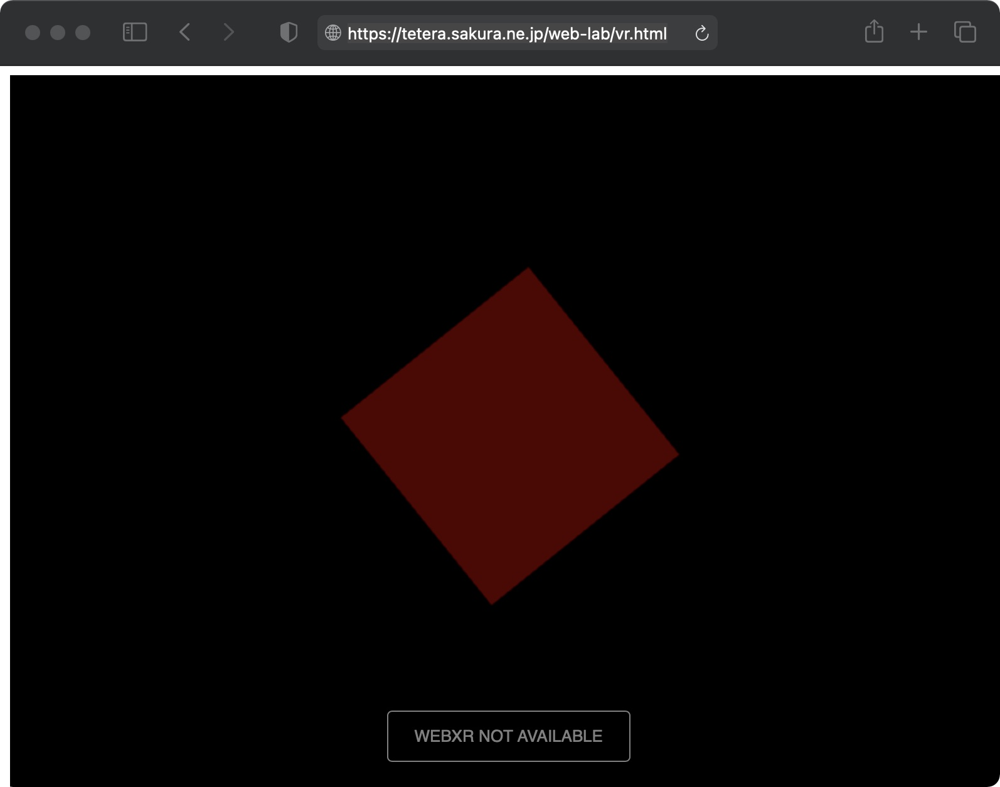
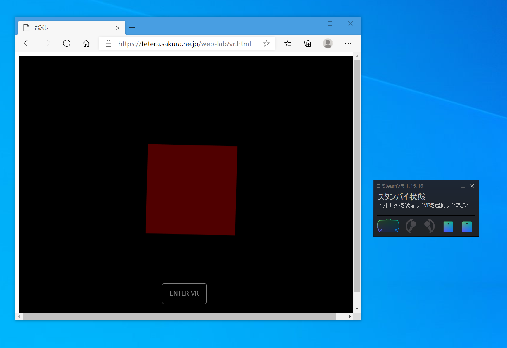
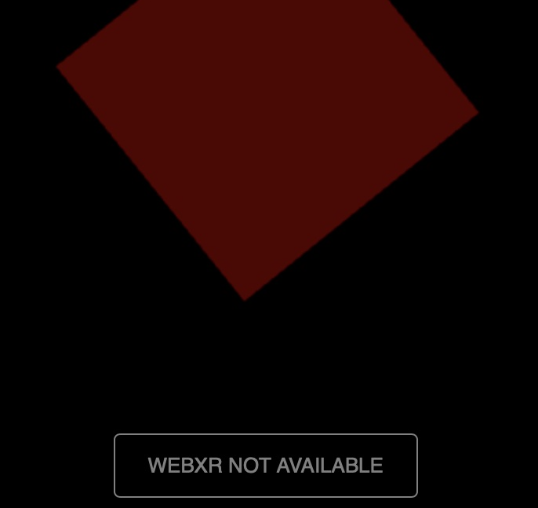
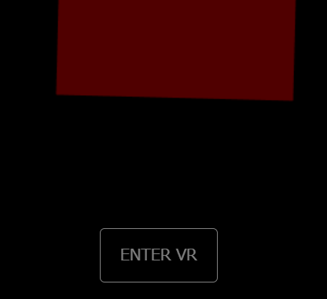
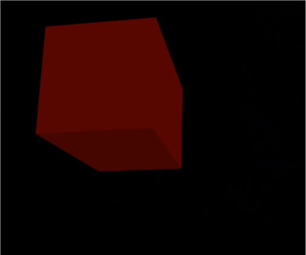
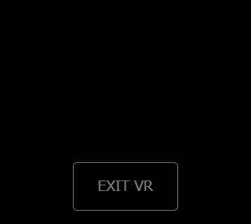
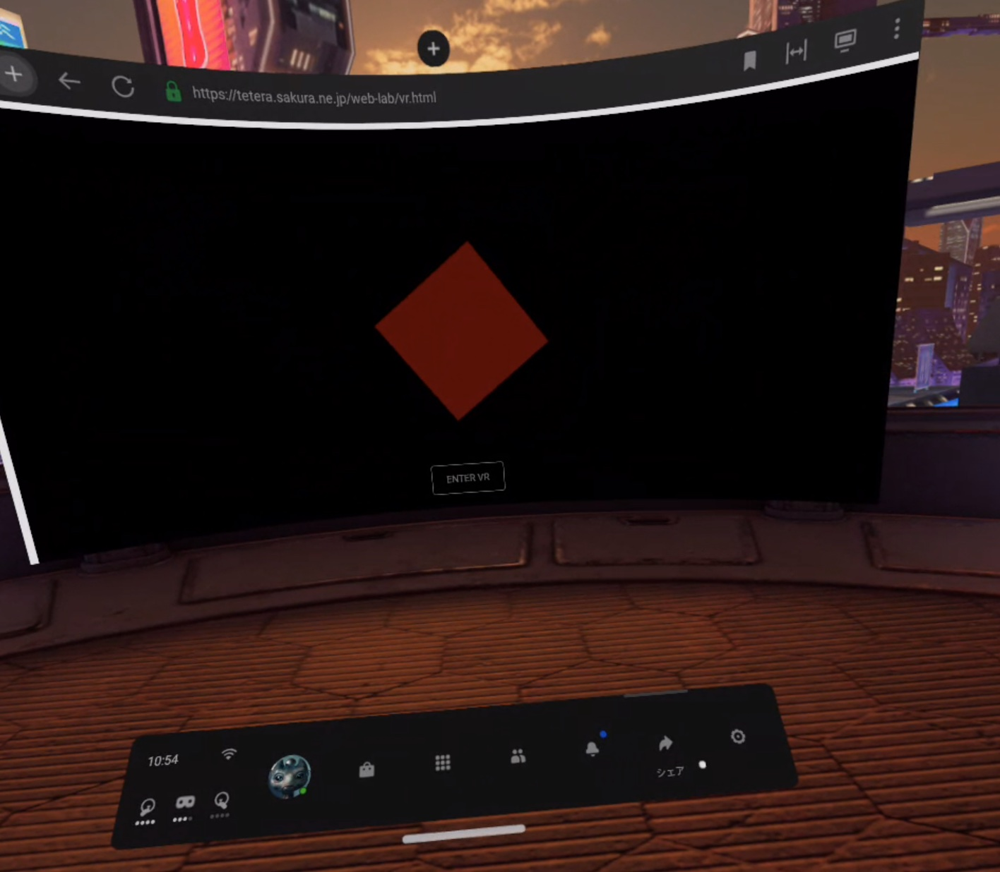
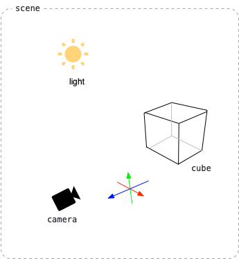
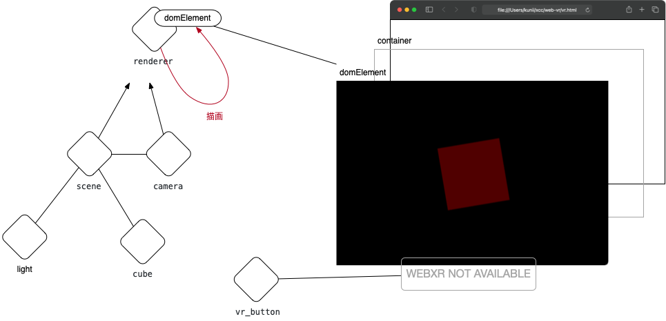

# in to VR

*昔も今も、アートマンは水に映った、おのれの影だ。<br/>それが魔族たちのウパニシャッドさ*<br/>
<br/>
*佐藤史生著：ワンゼロより*

## VR体験
　VR:virtual reality（本物と錯覚するほどの現実感）を体験することを意味する。<br/>
 錯覚の対象には、視覚、聴覚、触覚、味覚、嗅覚といったものがあるが、このリポジトリでは、主に視覚を対象とし、コンピュータで作り出した3次元イメージの中に自分が放り込まれたような体験を意味する。

### 3DCGI（コンピュータで作り出した3次元イメージ）
　3次元座標、素材情報といった数値情報からコンピュータが作りだすイメージ表現を指す。以後3DCGI：3 Dimandion Computer-generated imageryと呼ぶ。

### VRヘッドセット（ヘッドマウント式没入型3D表示装置）
　VR体験には、自分を取り巻く全方位の3DCGIを可視化する装置が必須となる。この装置を没入型3D表示装置と呼び、特に頭に被り立体視をおこなう装置をVRヘッドセットと呼ぶ。


### VR体験に必要なハードウエア
　VRを体験するためには以下のいずれかのハードウエアが必須となる。
* PC(注1)と接続したVRヘッドセット
  * [Oculus Rift](https://www.oculus.com/rift-s/)
  * [Vive](https://www.vive.com/jp/product/#all)
* VRヘッドセット一体型Android端末
  * [Oculus Quest/Quest2](https://www.oculus.com/quest/)

注1）ここでいうPCはWindowsマシンを指す。MacとVRヘッドセットを接続することも可能だが、一般的ではない。

## WebVR体験
　webブラウザ経由でVR体験を提供する方法。

　VR表示に対応していない状態（後述）のブラウザだと以下の画像のように「WEBXR NOT AVAILABLE」というボタンが出るが、対応していると「ENTER VR」というボタンが出る。「ENTER VR」ボタンを押すと、VRヘッドセット側に表示が移る。

|非対応|対応|
|-|-|
|||
|||
|VR体験ができない。|VR体験ができる。ブラウザを起動する前にVRヘッドセットをスタンバイ状態にしておく必要がある|

　「ENTER VR」ボタンを押すとブラウザ側のボタンは「EXIT VR」となり、ボタン以外の表示は消え、VRヘッドセットでVR体験が開始される。



<div style='text-align: center'>VRヘッドセット側</div>



<div style='text-align: center'>ブラウザ側</div>

　「EXIT VR」ボタンを押すと最初の状態に戻る
　Oculus questのようなVRヘッドセット一体型Android端末では、VR空間内に表示されるブラウザで、同じように「ENTER VR」ボタンが出る。コントローラのビームをボタンに当てて引き金を引けば、ブラウザ内に表示された3D空間が、現在のVR空間と切り替わる。もとに戻るには、コントローラのメニューボタンかOculusボタンを押す。
　


Oculus questのブラウザ

　上記サンプルは以下のURLで公開<br/>
 　↓<br/>
 https://tetera.sakura.ne.jp/web-lab/vr.html

　レンタルサーバーなどを用意し、そこに自分が用意したVR体験用のhtmlファイルを置いて、これをwebブラウザからアクセスしてもらうことで利用者にVR体験を提供する。<br/>
* LAN内にWebサーバーを用意しても良い。ここではMacを使う方法を例示する。


### WebVR体験に必要なソフトウエア
　WebでVR体験を提供を受ける側は、webブラウザが必要となる。webブラウザはHTML5対応とVRヘッドセット認識が必須となる。

　HTML5対応については現状のメジャーなwebブラウザなら対応しているが、VRヘッドセット認識は、接続しているVRヘッドセットによって異なる。Valve indexの場合、Steamアプリを起動しVRをONにしておいてからブラウザを起動することでVRヘッドセットが認識された。

* HTML5対応ブラウザ(Egde, Safari, Chrome, Firefox,...)

### WebVR体験を提供するために必要なソフトウエア
　webブラウザ経由でVR体験を提供する側は、サーバー側に以下の追加ソフトウエアが必要となる。
* three.js

#### three.js
　言語はJavasript。<br/>
　HTML5では3Dモデル表示APIとしてWebGLが提供される。このAPIだけで3D表示が可能だが、三角形平面を表示するといった、非常に基礎的な機能のために記述が膨大になる。これを簡素化するために利用する。

[https://threejs.org](https://threejs.org)

　最新ソースはGitHubで公開されているので、クローンして取り出せば良い。

[https://github.com/mrdoob/three.js/](https://github.com/mrdoob/three.js/)

　クローンしたリポジトリの容量は1GB近くになるが、最低限Webサーバー側に必要なのはリポジトリ(three.js)内の2つのフォルダとなる。

* build 
* examples/jsm

 これらをWebサーバーに置かれたVR体験用HTMLファイルから読み込める場所に置いて利用する。

#### Webサーバーが公開するフォルダ下の配置

 例えばVR体験用の処理を記述したHTMLファイルを

* vr.html

　とし、buildやexamples/jsmフォルダと共に、{Webサーバーが公開するフォルダ}下に、以下のようにweb-labフォルダに入れて配置した場合
```
{Webサーバーが公開するフォルダ}/
  web-lab/
    vr.html
  three.js/
    build/
    examples/
      jsm/
```
　vr.html内部では、javascript記述ブロック内で以下のようなimport文で、相対パス指定したbuildやexamples/jsmフォルダ内の必要なファイルを読み込むことなる。

 ```
 <!DOCTYPE html>
<html lang="en">
	<head>
  ・・・
	</head>
	<body>
	　　↓ javascript記述ブロック
		<script type="module">
			import * as THREE from '../three.js/build/three.module.js';
			import { VRButton } from '../three.js/examples/jsm/webxr/VRButton.js';
　　  ・・・      
		</script>
	</body>
</html>
 ```

　

#### 公開するVR体験用HTMLファイル

　サンプルで公開しているVR体験用HTMLファイルは、上述のjavascript記述ブロック内でthree.js関係の必要なモジュールを読み込んだ後に、以下のオブジェクト群を作成し、この情報をもとに3DCGIを実行するオブジェクトを作成し、画面を表示させている。

* 3DCGIするための情報オブジェクト
  * cube（立方体：形状、色）
  * light（光源）
  * camera（どこから見ているか）
  * scene（上記オブジェクト群をまとめたオブジェクト）




* renderer（3DCGIを実行するオブジェクト）
* vr_button（rendererをコントロールしVR体験を実行させるオブジェクト）




```
<script type="module">
	//	必須外部モジュールの読み込み
	import * as THREE from '../three.js/build/three.module.js';
	import {VRButton} from '../three.js/examples/jsm/webxr/VRButton.js';

	//	ブラウザページ内に、3D描画エリアを確保
	let container = document.createElement('div');
	document.body.appendChild(container);

	//	シーン作成
	let scene = new THREE.Scene();

	//	カメラ作成とシーンへの登録
	let camera = new THREE.PerspectiveCamera(90, window.innerWidth / window.innerHeight, 0.1, 10);
	camera.position.set(0, 1.2, 0);
	scene.add(camera);

	//	光源作成とシーンへの登録
	let light = new THREE.HemisphereLight(0x606060, 0x404040);
	scene.add(light);					

	//	立方体作成とシーンへの登録
	let cube = new THREE.Mesh(
		new THREE.BoxBufferGeometry(0.15, 0.15, 0.15), 
		new THREE.MeshLambertMaterial({ color: 0xff0000}) 
	);
	cube.position.set(0, camera.position.y, -0.3);			
	scene.add(cube);

	//	3D画面描画装置の作成と、描画先画面の3D描画エリアへの登録
	let renderer = new THREE.WebGLRenderer({antialias: true});
	renderer.setSize(window.innerWidth, window.innerHeight);
	container.appendChild(renderer.domElement);

	//	VRへの対応
	renderer.xr.enabled = true;
	let vr_button = VRButton.createButton(renderer);
	document.body.appendChild(vr_button);

	//	立方体を回転させるアニメーション処理	
	const clock = new THREE.Clock();
	renderer.setAnimationLoop(()=> {
		const delta = clock.getDelta();
		cube.rotation.set(0, 0, cube.rotation.z + delta);
		renderer.render(scene, camera);
	});
</script>
```

　このうち、VR体験用に必要な処理は以下の3行であり、これらをコメントアウトしたものは、一般的なWebブラウザでの3D表示となる。

```
			//	VRへの対応
			renderer.xr.enabled = true;
			let vr_button = VRButton.createButton(renderer);
			document.body.appendChild(vr_button);
```

　まずは、ここまで。